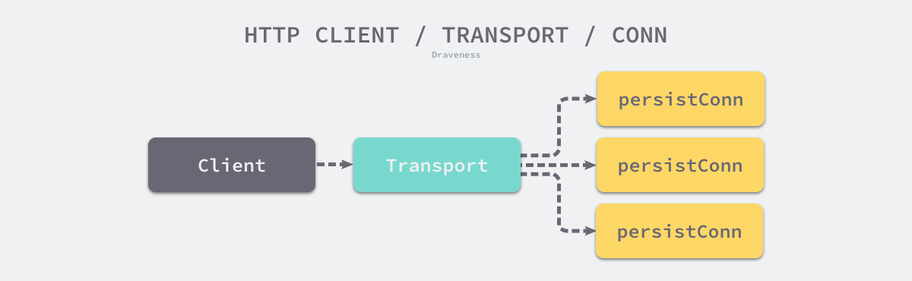

# 为什么选择《Go 语言设计与实现》

* About 作者

> 左书祺，2017年毕业于西安电子科技大学软件学院，某大厂（可能是字节）研发工程师，曾任美团高级工程师，区块链交易所基础架构组技术专家。「面向信仰编程」博客作者，开源图书《Go 语言设计与实现》作者。长期维护开源项目，Kubernetes 项目组成员，目前主要做 Kubernetes 调度器的开发。

---

# TA 做过什么

* 2017 https://draveness.me/2017-summary/
* 2018 https://draveness.me/2018-summary/
* 2019 https://draveness.me/2019-summary/

---

# Golang 标准库

* 是编写 idiomatic Go 代码的最佳参考（see [Hacker News](https://news.ycombinator.com/item?id=9155330) 讨论）
* 有一些专门的出版物
  + Go Standard Library Cookbook 2018.2
  + Go, The Standard Library 2020.6

---

# 大纲

* encoding/json
  + 提出问题，how to “Digging”
* net/http
  + 学习合理的抽象

---

# json.主要接口

```go
func Marshal(v interface{}) ([]byte, error)
func Unmarshal(data []byte, v interface{}) error
```

## Digging

* Q1: 为什么输入是 `interface{}`
* Q2: `Unmarshal` 分配内存的原则
* Q3: 阿里的fastjson有[安全漏洞](https://zhuanlan.zhihu.com/p/157211675)，go是否可能有呢

---

# 输入是 `interface{}`

```go
func TestJSONMarshal(t *testing.T) {
	type Obj struct {
		ID   int
		Name string
	}
	b, err := json.Marshal(Obj{1, "abc"})
	if err != nil {
		fmt.Println("error:", err)
	}
	fmt.Println("json:", string(b))
}
```

* `Obj{1, "abc"}` 转换成 `interface{}` 需要分配内存
* Why? How (do you know)?

---

# 动手时间，看汇编代码

```shell
$ dlv test -- -test.run ^TestJSONMarshal$
(dlv) b TestJSONMarshal
(dlv) c
(dlv) disass
```

```
...
mov qword ptr [rsp+0x8], rax
call $runtime.convT2E
mov rax, qword ptr [rsp+0x18]
...
mov qword ptr [rsp+0x8], rax
call $encoding/json.Marshal
mov rax, qword ptr [rsp+0x18]
...
```

---

# 找到对应的源码

```go
func convT2E(t *_type, elem unsafe.Pointer) (e eface) {
	x := mallocgc(t.size, t, true)
	typedmemmove(t, x, elem)
	e._type = t
	e.data = x
	return
}
```

---

# 做实验，比较性能

```go
func BenchmarkZapString(b *testing.B) {
	for i := 0; i < b.N; i++ {
		zap.String("key", "value")
	}
}

func BenchmarkZapAny(b *testing.B) {
	for i := 0; i < b.N; i++ {
		zap.Any("key", "value")
	}
}
```

```
BenchmarkZapString-8    1000000000               0.286 ns/op
BenchmarkZapAny-8       35849000                 30.4 ns/op
```

* 100倍！
* 转换成 `interface{}` 有额外的内存分配和GC

---

# 总结：从 Q1 中 Dig 和学会

* 在没有泛型之前，Go 通过把数据装箱(Boxing)成 `eface/iface` 结构体，来处理任意类型
* 装箱操作有100倍的性能损失，但仍然是很快的（纳秒级）

## Dig more!

* `eface` 和 `iface` 有什么区别
* 为什么 `Marshal` 返回 `[]byte` 而不是 `string`
* 从问题切入，串连 Go 语言相关的所有知识，融会贯通

---

# `Unmarshal` 分配内存的原则

```go
func TestJsonUnmarshal(t *testing.T) {
	var verify = func(f func() (interface{}, error)) {
		if v, err := f(); err == nil {
			fmt.Println("ok:", v)
		} else {
			fmt.Println("error:", err)
		}
	}
	verify(func() (interface{}, error) {
		var v []int = nil
		err := json.Unmarshal([]byte(`[1,2,3,4]`), &v)
		return v, err
	})
	verify(func() (interface{}, error) {
		var v map[string]string = nil
		err := json.Unmarshal([]byte(`{"a":"1","b":"2"}`), &v)
		return v, err
	})
	verify(func() (interface{}, error) {
		var p *int = nil
		err := json.Unmarshal([]byte(`1`), p)
		return p, err
	})
	verify(func() (interface{}, error) {
		var p *int = nil
		err := json.Unmarshal([]byte(`1`), &p)
		return p, err
	})
}
```

---

# `Unmarshal` 对 map 的处理

* key 可以是整型

```go
func TestJSONUnmarshalToMap(t *testing.T) {
	str := `
	{
		"1": "abc",
		"2": "def",
		"3": "ghi"
	}`
	var foo map[int]string
	if err := json.Unmarshal([]byte(str), &foo); err != nil {
		t.Fatalf("unmarshal str to a map: %v", err)
	}
	fmt.Println(foo)
}
```

---

# `Unmarshal` 对 struct 的处理

* key 可以大小写无关

```go

func TestJSONUnmarshalToStruct(t *testing.T) {
	str := `
	{
		"name": "Ann",
		"AGE": "18",
		"Sex": "F"
	}`
	type Person struct {
		Name string
		Age  string `json:"aGe"`
		Sex  string `json:"seX"`
	}
	var foo Person
	if err := json.Unmarshal([]byte(str), &foo); err != nil {
		t.Fatalf("unmarshal str to a struct: %v", err)
	}
	fmt.Println(foo)
}
```

---

# http.服务端

* Handler vs HandlerFunc
* What is ServeMux

---

# Functional Interface

```go
type Handler interface {
	ServeHTTP(ResponseWriter, *Request)
}

type HandlerFunc func(ResponseWriter, *Request)

func (f HandlerFunc) ServeHTTP(w ResponseWriter, r *Request) {
	f(w, r)
}
```

* https://docs.oracle.com/javase/8/docs/api/java/lang/FunctionalInterface.html
* https://www.typescriptlang.org/docs/handbook/interfaces.html#function-types

---

# Dig more: What is `interface`

* Interface 可以描述一批类型 (Type) 的形状，是更高一级的抽象
* 大部分业务用 L1 和 L2 级抽象，就可以写出结构优良的代码
* 避免使用无必要的 interface，增加代码的可读性

```ascii
         +---------+
    L3   |Interface|
         +---------+

         +------+    +------+
    L2   | Type +---->Method|
         +------+    +------+

         +------+    +--------+   +--------+
    L1   |Object+---->Property|   |Function|
         +------+    +--------+   +--------+
```

---

# `ServeMux` 管理 http path 的路由

```java
class ServerMux implements Handler {
    @Override ServeHTTP(ResponseWriter, *Request)
    Handle(pattern string, handler Handler) // 关键方法：路由注册
    // ...
}
```

* ServerMux 可以嵌套

---

# 组装，启动 http.Server

```
mux := NewServeMux()
mux.Handle(...)
mux.Handle(...)
// ...
server := &Server{Addr: addr, Handler: mux}
server.ListenAndServe()
```

* ikafka 也借鉴了这种模式
* 使用 `interface` 要有出处，不要异想天开的发明新模式

---

# http.客户端

* 连接池
* 来回 RoundTrip
* 传输 Transport

---

# http.Client

* 应该创建一次，重用；而不是按需要创建
* 协程安全

---

# 不要用默认的 http.Client{}

```go
	httpclient = &http.Client{
		Transport: &http.Transport{
			DialContext: (&net.Dialer{
				Timeout: 2 * time.Second,
			}).DialContext,
			MaxIdleConns:        1000,
			MaxIdleConnsPerHost: 200,
			IdleConnTimeout:     10 * time.Minute,
			MaxConnsPerHost:     1000,
		},
		Timeout: 1 * time.Second,
	}
```

---

# http.Transport 以外

* `golang.org/x/net/http2.ClientConn`
* `github.com/lucas-clemente/quic-go/http3.RoundTripper`

---

# 负载均衡

* http.Client 没有负载均衡的能力
* 依赖域名后的 Nginx 代理

---

# 熔断

* 业务用通常用 http 客户端来访问第三方服务（ymicro 以外），加上熔断更保险

```go
	httpbreaker = gobreaker.NewCircuitBreaker(gobreaker.Settings{
		Name:        "breaker_for_httpclient",
		MaxRequests: 10,
		Interval:    5 * time.Second,
		Timeout:     60 * time.Second,
		ReadyToTrip: func(counts gobreaker.Counts) bool {
			return counts.ConsecutiveFailures > 5
		},
		OnStateChange: func(name string, from gobreaker.State, to gobreaker.State) {
		},
	})
```

---

# 每个 HTTP 客户端连接的消耗



* go pconn.readLoop()
* go pconn.writeLoop()
* 每个物理连接，对应两个协程

---

# 总结：Golang 标准库学习心得

* 提出问题，how to “Digging”
* 从问题切入，串连 Go 语言相关的所有知识，融会贯通
* 学习合理的抽象，避免使用无必要的 interface，增加代码的可读性
* 多看标准库里的文档和例子；业务代码中的模式，要有出处，不要发明新模式

---

<end>
